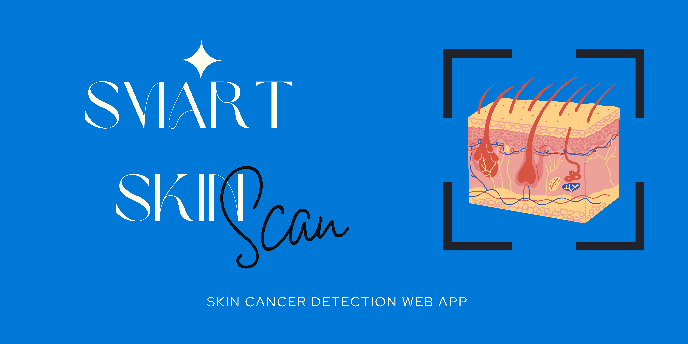

# SmartSkin Scan

Welcome to the SmartSkin Scan (Skin Cancer Detection Web App)! This application leverages the power of deep learning to assist users in detecting skin cancer through image analysis. Whether you're a healthcare professional or seeking to monitor skin health, this tool provides an easy-to-use interface for detection, visualization, and model training.

## Features

### Home
On the Home page, users get an overview of what the web app offers. The application is designed to help detect skin cancer by analyzing skin images. With this app, users can:
- Upload images of skin lesions for analysis. 📸                  
- Visualize detailed metrics about the model’s performance. 📊
- Train and customize the skin cancer detection model according to their needs. 🧠

### Detection
The Detection page allows users to detect skin cancer and receive immediate feedback:
- **Upload Images**: Users can upload skin images from their device for analysis. 📤
- **Immediate Feedback**: Whether the uploaded image is benign (non-cancerous) or malignant (cancerous).               

### Visualizing
The Visualizing page provides various metrics and visual aids to understand the model's performance:
- **Test Accuracy**: Displays the final accuracy on the test dataset. 🎯
- **Training and Validation Accuracy**: Shows the model's performance improvement with each epoch. 📈
- **Loss Metrics**: Tracks the reduction in loss throughout the training process. 📉
- **Confusion Matrix**: Provides a visual representation of the model’s classification results. 🧩

### Train Model
On the Train Model page, users can train the skin cancer detection model in real-time. This page offers:
- **Customize**: Options to adjust the number of epochs and learning rates according to the user's needs. 🛠️
- **Track Progress**: Real-time updates and visuals of the training process. 📈
- **Evaluate**: Performance evaluation of the model with an option to download the updated model. 📊

## Getting Started

### Prerequisites
To run this web app, you need to have the following installed on your machine:
- Python 3.x
- Streamlit
- TensorFlow
- OpenCV
- Plotly
- Numpy
- Pandas
- Pillow
- Scipy

### Installation
Clone the repository:
   ```sh
   git clone https://github.com/your-username/skin-cancer-detection-web-app.git
   cd skin-cancer-detection-web-app
   ```
## Requirements

Before running the app, please ensure you have created a virtual environment (`.venv`). Follow these steps to set up the environment:

1. **Create a virtual environment:**
   ```bash
   python -m venv .venv
   ```

2. **Activate the virtual environment:**

    On Windows:
     ```bash
     .venv\Scripts\activate
     ```
   On macOS and Linux:
     ```bash
     source .venv/bin/activate
     ```

4. **Install required packages:**
   ```bash
   pip install -r requirements.txt
    ```

### Running the App
To start the web app, navigate to the project directory and run:
```sh
streamlit run app.py
```

## Usage

### Home
Navigate to the Home page to get a brief introduction to the web app’s capabilities and features.

### Detection
- **Upload Image**: Click on the "Upload" button to select an image from your device. The app will process the image and provide a diagnosis.

### Visualizing
View detailed metrics about the model’s performance, including accuracy, loss, and confusion matrix.

### Train Model
- **Customize Training**: Adjust the epochs and learning rate settings.
- **Start Training**: Click on "Train" to begin training the model with live updates.
- **Download Model**: After training, evaluate the model and download the updated version.

## Contributing
Contributions are welcome! Please fork the repository and create a pull request with your changes.
